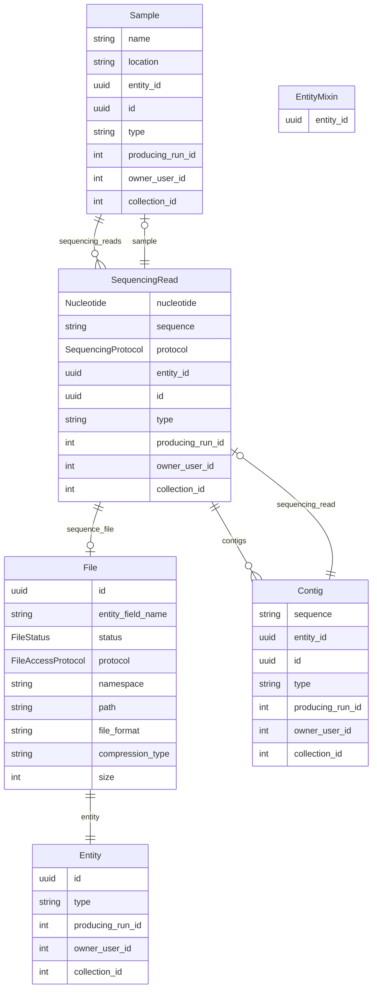

```mermaid
erDiagram
Entity {
    uuid id  
    string type  
    int producing_run_id  
    int owner_user_id  
    int collection_id  
}
File {
    uuid id  
    string entity_field_name  
    FileStatus status  
    FileAccessProtocol protocol  
    string namespace  
    string path  
    string file_format  
    string compression_type  
    int size  
}
Sample {
    string name  
    string location  
    uuid entity_id  
    uuid id  
    string type  
    int producing_run_id  
    int owner_user_id  
    int collection_id  
}
SequencingRead {
    Nucleotide nucleotide  
    string sequence  
    SequencingProtocol protocol  
    uuid entity_id  
    uuid id  
    string type  
    int producing_run_id  
    int owner_user_id  
    int collection_id  
}
Contig {
    string sequence  
    uuid entity_id  
    uuid id  
    string type  
    int producing_run_id  
    int owner_user_id  
    int collection_id  
}
EntityMixin {
    uuid entity_id  
}

File ||--|| Entity : "entity"
Sample ||--}o SequencingRead : "sequencing_reads"
SequencingRead ||--|o File : "sequence_file"
SequencingRead ||--|o Sample : "sample"
SequencingRead ||--}o Contig : "contigs"
Contig ||--|o SequencingRead : "sequencing_read"

```

