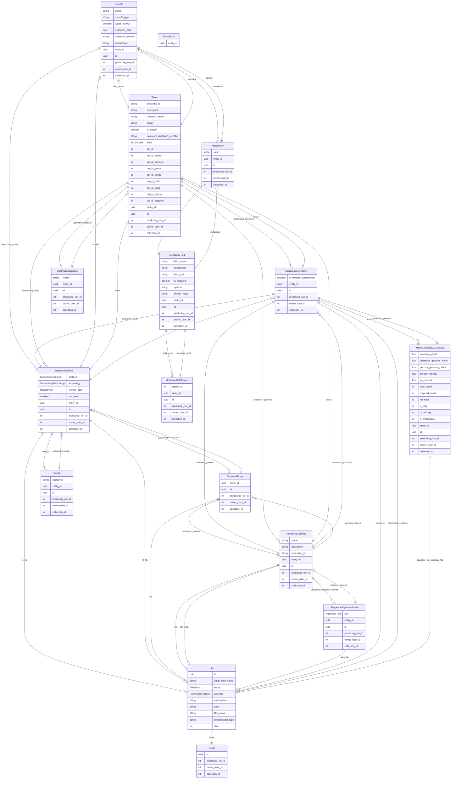

```mermaid
erDiagram
Entity {
    uuid id  
    int producing_run_id  
    int owner_user_id  
    int collection_id  
}
File {
    uuid id  
    string entity_field_name  
    FileStatus status  
    FileAccessProtocol protocol  
    string namespace  
    string path  
    string file_format  
    string compression_type  
    int size  
}
Sample {
    string name  
    string sample_type  
    boolean water_control  
    date collection_date  
    string collection_location  
    string description  
    uuid entity_id  
    uuid id  
    int producing_run_id  
    int owner_user_id  
    int collection_id  
}
SequencingRead {
    SequencingProtocol protocol  
    SequencingTechnology technology  
    NucleicAcid nucleic_acid  
    boolean has_ercc  
    uuid entity_id  
    uuid id  
    int producing_run_id  
    int owner_user_id  
    int collection_id  
}
GenomicRange {
    uuid entity_id  
    uuid id  
    int producing_run_id  
    int owner_user_id  
    int collection_id  
}
ReferenceGenome {
    string name  
    string description  
    string accession_id  
    uuid entity_id  
    uuid id  
    int producing_run_id  
    int owner_user_id  
    int collection_id  
}
SequenceAlignmentIndex {
    AlignmentTool tool  
    uuid entity_id  
    uuid id  
    int producing_run_id  
    int owner_user_id  
    int collection_id  
}
Metadatum {
    string value  
    uuid entity_id  
    uuid id  
    int producing_run_id  
    int owner_user_id  
    int collection_id  
}
MetadataField {
    string field_name  
    string description  
    string field_type  
    boolean is_required  
    string options  
    string default_value  
    uuid entity_id  
    uuid id  
    int producing_run_id  
    int owner_user_id  
    int collection_id  
}
MetadataFieldProject {
    int project_id  
    uuid entity_id  
    uuid id  
    int producing_run_id  
    int owner_user_id  
    int collection_id  
}
ConsensusGenome {
    boolean is_reverse_complement  
    uuid entity_id  
    uuid id  
    int producing_run_id  
    int owner_user_id  
    int collection_id  
}
MetricConsensusGenome {
    float coverage_depth  
    float reference_genome_length  
    float percent_genome_called  
    float percent_identity  
    float gc_percent  
    int total_reads  
    int mapped_reads  
    int ref_snps  
    int n_actg  
    int n_missing  
    int n_ambiguous  
    uuid entity_id  
    uuid id  
    int producing_run_id  
    int owner_user_id  
    int collection_id  
}
Taxon {
    string wikipedia_id  
    string description  
    string common_name  
    string name  
    boolean is_phage  
    string upstream_database_identifier  
    TaxonLevel level  
    int tax_id  
    int tax_id_parent  
    int tax_id_species  
    int tax_id_genus  
    int tax_id_family  
    int tax_id_order  
    int tax_id_class  
    int tax_id_phylum  
    int tax_id_kingdom  
    uuid entity_id  
    uuid id  
    int producing_run_id  
    int owner_user_id  
    int collection_id  
}
UpstreamDatabase {
    string name  
    uuid entity_id  
    uuid id  
    int producing_run_id  
    int owner_user_id  
    int collection_id  
}
Contig {
    string sequence  
    uuid entity_id  
    uuid id  
    int producing_run_id  
    int owner_user_id  
    int collection_id  
}
EntityMixin {
    uuid entity_id  
}

File ||--|| Entity : "entity"
Sample ||--|o Taxon : "host_taxon"
Sample ||--}o SequencingRead : "sequencing_reads"
Sample ||--}o Metadatum : "metadatas"
SequencingRead ||--|o Sample : "sample"
SequencingRead ||--|o File : "r1_file"
SequencingRead ||--|o File : "r2_file"
SequencingRead ||--|o Taxon : "taxon"
SequencingRead ||--|o GenomicRange : "primer_file"
SequencingRead ||--}o ConsensusGenome : "consensus_genomes"
SequencingRead ||--}o Contig : "contigs"
GenomicRange ||--|| ReferenceGenome : "reference_genome"
GenomicRange ||--|o File : "file"
GenomicRange ||--}o SequencingRead : "sequencing_reads"
ReferenceGenome ||--|o File : "file"
ReferenceGenome ||--|o File : "file_index"
ReferenceGenome ||--|| Taxon : "taxon"
ReferenceGenome ||--}o SequenceAlignmentIndex : "sequence_alignment_indices"
ReferenceGenome ||--}o ConsensusGenome : "consensus_genomes"
ReferenceGenome ||--}o GenomicRange : "genomic_ranges"
SequenceAlignmentIndex ||--|o File : "index_file"
SequenceAlignmentIndex ||--|| ReferenceGenome : "reference_genome"
Metadatum ||--|| Sample : "sample"
Metadatum ||--|| MetadataField : "metadata_field"
MetadataField ||--}| MetadataFieldProject : "field_group"
MetadataField ||--}o Metadatum : "metadatas"
MetadataFieldProject ||--|| MetadataField : "metadata_field"
ConsensusGenome ||--|| Taxon : "taxon"
ConsensusGenome ||--|| SequencingRead : "sequence_read"
ConsensusGenome ||--|| ReferenceGenome : "reference_genome"
ConsensusGenome ||--|o File : "sequence"
ConsensusGenome ||--|o File : "intermediate_outputs"
ConsensusGenome ||--}o MetricConsensusGenome : "metrics"
MetricConsensusGenome ||--|| ConsensusGenome : "consensus_genome"
MetricConsensusGenome ||--|o File : "coverage_viz_summary_file"
Taxon ||--|| UpstreamDatabase : "upstream_database"
Taxon ||--}o ConsensusGenome : "consensus_genomes"
Taxon ||--}o ReferenceGenome : "reference_genomes"
Taxon ||--}o SequencingRead : "sequencing_reads"
Taxon ||--}o Sample : "samples"
UpstreamDatabase ||--}o Taxon : "taxa"
Contig ||--|o SequencingRead : "sequencing_read"

```

