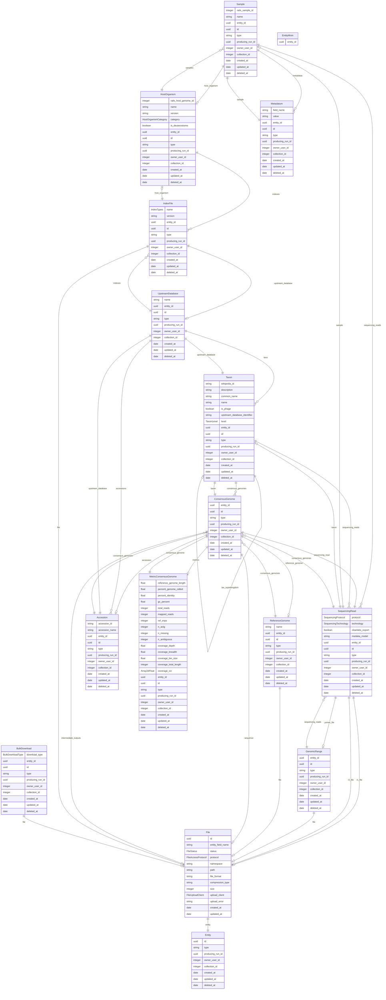

```mermaid
erDiagram
Entity {
    uuid id  
    string type  
    uuid producing_run_id  
    integer owner_user_id  
    integer collection_id  
    date created_at  
    date updated_at  
    date deleted_at  
}
File {
    uuid id  
    string entity_field_name  
    FileStatus status  
    FileAccessProtocol protocol  
    string namespace  
    string path  
    string file_format  
    string compression_type  
    integer size  
    FileUploadClient upload_client  
    string upload_error  
    date created_at  
    date updated_at  
}
Sample {
    integer rails_sample_id  
    string name  
    uuid entity_id  
    uuid id  
    string type  
    uuid producing_run_id  
    integer owner_user_id  
    integer collection_id  
    date created_at  
    date updated_at  
    date deleted_at  
}
SequencingRead {
    SequencingProtocol protocol  
    SequencingTechnology technology  
    boolean clearlabs_export  
    string medaka_model  
    uuid entity_id  
    uuid id  
    string type  
    uuid producing_run_id  
    integer owner_user_id  
    integer collection_id  
    date created_at  
    date updated_at  
    date deleted_at  
}
GenomicRange {
    uuid entity_id  
    uuid id  
    string type  
    uuid producing_run_id  
    integer owner_user_id  
    integer collection_id  
    date created_at  
    date updated_at  
    date deleted_at  
}
ReferenceGenome {
    string name  
    uuid entity_id  
    uuid id  
    string type  
    uuid producing_run_id  
    integer owner_user_id  
    integer collection_id  
    date created_at  
    date updated_at  
    date deleted_at  
}
Accession {
    string accession_id  
    string accession_name  
    uuid entity_id  
    uuid id  
    string type  
    uuid producing_run_id  
    integer owner_user_id  
    integer collection_id  
    date created_at  
    date updated_at  
    date deleted_at  
}
HostOrganism {
    integer rails_host_genome_id  
    string name  
    string version  
    HostOrganismCategory category  
    boolean is_deuterostome  
    uuid entity_id  
    uuid id  
    string type  
    uuid producing_run_id  
    integer owner_user_id  
    integer collection_id  
    date created_at  
    date updated_at  
    date deleted_at  
}
Metadatum {
    string field_name  
    string value  
    uuid entity_id  
    uuid id  
    string type  
    uuid producing_run_id  
    integer owner_user_id  
    integer collection_id  
    date created_at  
    date updated_at  
    date deleted_at  
}
ConsensusGenome {
    uuid entity_id  
    uuid id  
    string type  
    uuid producing_run_id  
    integer owner_user_id  
    integer collection_id  
    date created_at  
    date updated_at  
    date deleted_at  
}
MetricConsensusGenome {
    float reference_genome_length  
    float percent_genome_called  
    float percent_identity  
    float gc_percent  
    integer total_reads  
    integer mapped_reads  
    integer ref_snps  
    integer n_actg  
    integer n_missing  
    integer n_ambiguous  
    float coverage_depth  
    float coverage_breadth  
    float coverage_bin_size  
    integer coverage_total_length  
    Array2dFloat coverage_viz  
    uuid entity_id  
    uuid id  
    string type  
    uuid producing_run_id  
    integer owner_user_id  
    integer collection_id  
    date created_at  
    date updated_at  
    date deleted_at  
}
Taxon {
    string wikipedia_id  
    string description  
    string common_name  
    string name  
    boolean is_phage  
    string upstream_database_identifier  
    TaxonLevel level  
    uuid entity_id  
    uuid id  
    string type  
    uuid producing_run_id  
    integer owner_user_id  
    integer collection_id  
    date created_at  
    date updated_at  
    date deleted_at  
}
UpstreamDatabase {
    string name  
    uuid entity_id  
    uuid id  
    string type  
    uuid producing_run_id  
    integer owner_user_id  
    integer collection_id  
    date created_at  
    date updated_at  
    date deleted_at  
}
IndexFile {
    IndexTypes name  
    string version  
    uuid entity_id  
    uuid id  
    string type  
    uuid producing_run_id  
    integer owner_user_id  
    integer collection_id  
    date created_at  
    date updated_at  
    date deleted_at  
}
BulkDownload {
    BulkDownloadType download_type  
    uuid entity_id  
    uuid id  
    string type  
    uuid producing_run_id  
    integer owner_user_id  
    integer collection_id  
    date created_at  
    date updated_at  
    date deleted_at  
}
EntityMixin {
    uuid entity_id  
}

File ||--|| Entity : "entity"
Sample ||--|o HostOrganism : "host_organism"
Sample ||--}o SequencingRead : "sequencing_reads"
Sample ||--}o Metadatum : "metadatas"
SequencingRead ||--|o Sample : "sample"
SequencingRead ||--|o File : "r1_file"
SequencingRead ||--|o File : "r2_file"
SequencingRead ||--|o Taxon : "taxon"
SequencingRead ||--|o GenomicRange : "primer_file"
SequencingRead ||--}o ConsensusGenome : "consensus_genomes"
GenomicRange ||--|o File : "file"
GenomicRange ||--}o SequencingRead : "sequencing_reads"
ReferenceGenome ||--|o File : "file"
ReferenceGenome ||--}o ConsensusGenome : "consensus_genomes"
Accession ||--|| UpstreamDatabase : "upstream_database"
Accession ||--}o ConsensusGenome : "consensus_genomes"
HostOrganism ||--}o IndexFile : "indexes"
HostOrganism ||--}o Sample : "samples"
Metadatum ||--|| Sample : "sample"
ConsensusGenome ||--|| Taxon : "taxon"
ConsensusGenome ||--|| SequencingRead : "sequencing_read"
ConsensusGenome ||--|o ReferenceGenome : "reference_genome"
ConsensusGenome ||--|o Accession : "accession"
ConsensusGenome ||--|o File : "sequence"
ConsensusGenome ||--|o MetricConsensusGenome : "metrics"
ConsensusGenome ||--|o File : "intermediate_outputs"
MetricConsensusGenome ||--|| ConsensusGenome : "consensus_genome"
Taxon ||--|| UpstreamDatabase : "upstream_database"
Taxon ||--|o Taxon : "tax_parent"
Taxon ||--|o Taxon : "tax_species"
Taxon ||--|o Taxon : "tax_genus"
Taxon ||--|o Taxon : "tax_family"
Taxon ||--|o Taxon : "tax_order"
Taxon ||--|o Taxon : "tax_class"
Taxon ||--|o Taxon : "tax_phylum"
Taxon ||--|o Taxon : "tax_kingdom"
Taxon ||--|o Taxon : "tax_superkingdom"
Taxon ||--}o ConsensusGenome : "consensus_genomes"
Taxon ||--}o SequencingRead : "sequencing_reads"
UpstreamDatabase ||--}o Taxon : "taxa"
UpstreamDatabase ||--}o IndexFile : "indexes"
UpstreamDatabase ||--}o Accession : "accessions"
IndexFile ||--|o File : "file"
IndexFile ||--|o UpstreamDatabase : "upstream_database"
IndexFile ||--|o HostOrganism : "host_organism"
BulkDownload ||--|o File : "file"

```

