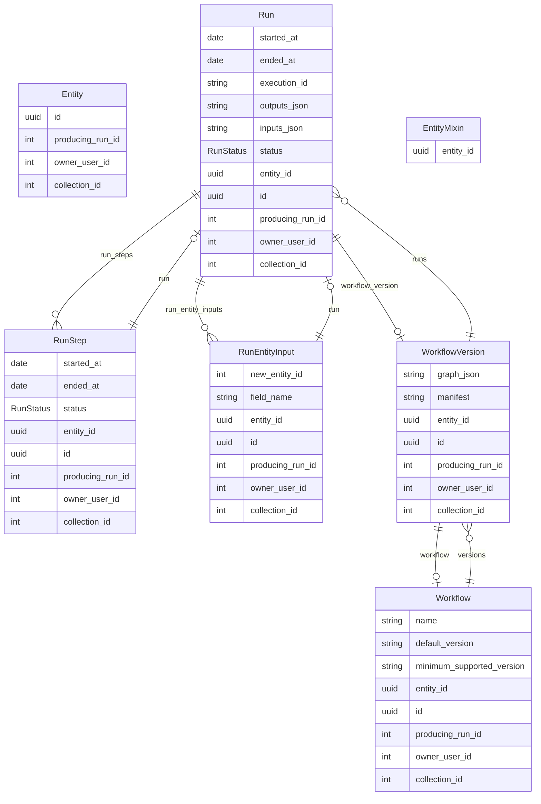

```mermaid
erDiagram
Entity {
    uuid id  
    int producing_run_id  
    int owner_user_id  
    int collection_id  
}
Run {
    date started_at  
    date ended_at  
    string execution_id  
    string outputs_json  
    string inputs_json  
    RunStatus status  
    uuid entity_id  
    uuid id  
    int producing_run_id  
    int owner_user_id  
    int collection_id  
}
Workflow {
    string name  
    string default_version  
    string minimum_supported_version  
    uuid entity_id  
    uuid id  
    int producing_run_id  
    int owner_user_id  
    int collection_id  
}
RunStep {
    date started_at  
    date ended_at  
    RunStatus status  
    uuid entity_id  
    uuid id  
    int producing_run_id  
    int owner_user_id  
    int collection_id  
}
RunEntityInput {
    int new_entity_id  
    string field_name  
    uuid entity_id  
    uuid id  
    int producing_run_id  
    int owner_user_id  
    int collection_id  
}
WorkflowVersion {
    string graph_json  
    string manifest  
    uuid entity_id  
    uuid id  
    int producing_run_id  
    int owner_user_id  
    int collection_id  
}
EntityMixin {
    uuid entity_id  
}

Run ||--|o WorkflowVersion : "workflow_version"
Run ||--}o RunStep : "run_steps"
Run ||--}o RunEntityInput : "run_entity_inputs"
Workflow ||--}o WorkflowVersion : "versions"
RunStep ||--|o Run : "run"
RunEntityInput ||--|o Run : "run"
WorkflowVersion ||--|o Workflow : "workflow"
WorkflowVersion ||--}o Run : "runs"

```

