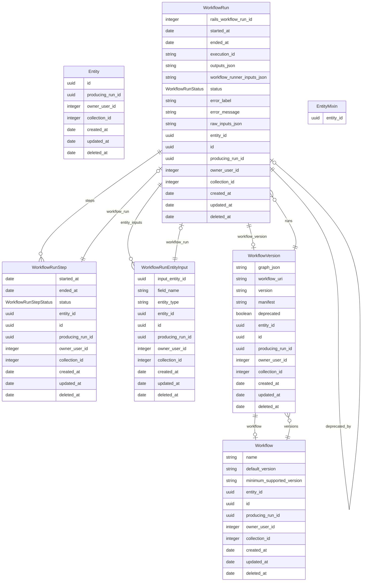

```mermaid
erDiagram
Entity {
    uuid id  
    uuid producing_run_id  
    integer owner_user_id  
    integer collection_id  
    date created_at  
    date updated_at  
    date deleted_at  
}
WorkflowRun {
    integer rails_workflow_run_id  
    date started_at  
    date ended_at  
    string execution_id  
    string outputs_json  
    string workflow_runner_inputs_json  
    WorkflowRunStatus status  
    string error_label  
    string error_message  
    string raw_inputs_json  
    uuid entity_id  
    uuid id  
    uuid producing_run_id  
    integer owner_user_id  
    integer collection_id  
    date created_at  
    date updated_at  
    date deleted_at  
}
Workflow {
    string name  
    string default_version  
    string minimum_supported_version  
    uuid entity_id  
    uuid id  
    uuid producing_run_id  
    integer owner_user_id  
    integer collection_id  
    date created_at  
    date updated_at  
    date deleted_at  
}
WorkflowRunStep {
    date started_at  
    date ended_at  
    WorkflowRunStepStatus status  
    uuid entity_id  
    uuid id  
    uuid producing_run_id  
    integer owner_user_id  
    integer collection_id  
    date created_at  
    date updated_at  
    date deleted_at  
}
WorkflowRunEntityInput {
    uuid input_entity_id  
    string field_name  
    string entity_type  
    uuid entity_id  
    uuid id  
    uuid producing_run_id  
    integer owner_user_id  
    integer collection_id  
    date created_at  
    date updated_at  
    date deleted_at  
}
WorkflowVersion {
    string graph_json  
    string workflow_uri  
    string version  
    string manifest  
    boolean deprecated  
    uuid entity_id  
    uuid id  
    uuid producing_run_id  
    integer owner_user_id  
    integer collection_id  
    date created_at  
    date updated_at  
    date deleted_at  
}
EntityMixin {
    uuid entity_id  
}

WorkflowRun ||--|o WorkflowVersion : "workflow_version"
WorkflowRun ||--}o WorkflowRunStep : "steps"
WorkflowRun ||--}o WorkflowRunEntityInput : "entity_inputs"
WorkflowRun ||--|o WorkflowRun : "deprecated_by"
Workflow ||--}o WorkflowVersion : "versions"
WorkflowRunStep ||--|o WorkflowRun : "workflow_run"
WorkflowRunEntityInput ||--|o WorkflowRun : "workflow_run"
WorkflowVersion ||--|o Workflow : "workflow"
WorkflowVersion ||--}o WorkflowRun : "runs"

```

